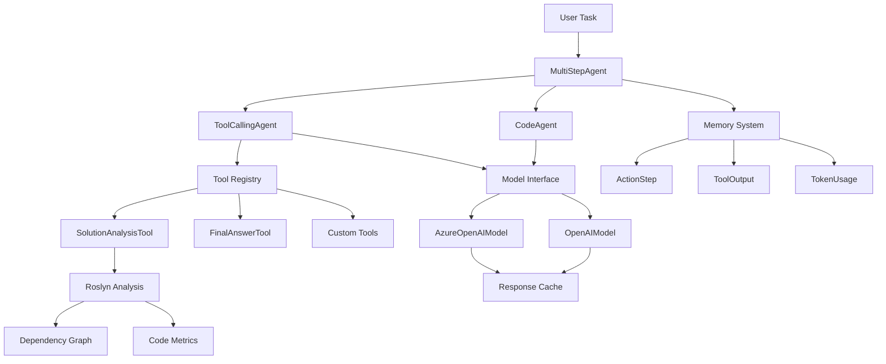
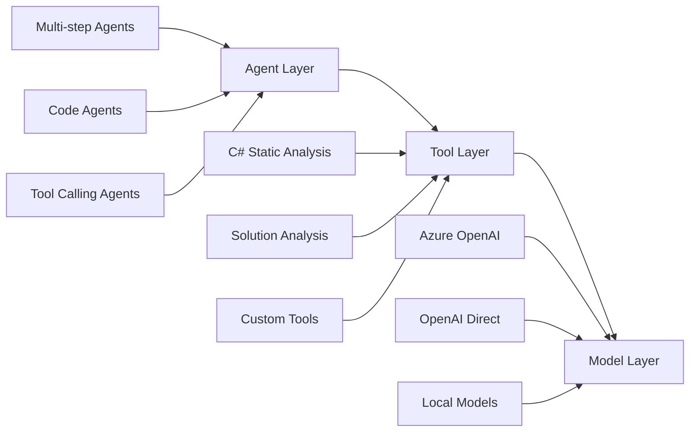

# NETAgents 🚀

> **A powerful .NET implementation of multi-agent AI systems, reimagined for the C# ecosystem**



**NETAgents** is a complete .NET rewrite of Hugging Face's `smolagents` library, purpose-built for C# developers who want to harness the power of AI agents with native .NET performance, static analysis, and deep ecosystem integration.

## ✨ Why NETAgents?

### 🔍 **Native C# Static Analysis**
Unlike Python-based solutions, NETAgents provides **100% contextual awareness** of your C# codebase through advanced Roslyn-powered static analysis:

```csharp
var solutionTool = new SolutionAnalysisTool();
var agent = new ToolCallingAgent([solutionTool], model);

// Get complete dependency graphs, project metrics, and code insights
var result = await agent.RunAsync("Analyze my solution and suggest refactoring opportunities");
```

### 🎯 **Direct C# Object Manipulation**
Work directly with .NET objects - no serialization overhead or type conversion headaches:

```csharp
// Native C# types throughout the pipeline
public class CustomerAnalysisTool : Tool
{
    public override object Forward(object?[]? args, Dictionary<string, object>? kwargs)
    {
        var customer = kwargs["customer"] as Customer; // Direct object access
        return new AnalysisResult 
        { 
            Score = CalculateScore(customer),
            Recommendations = GenerateRecommendations(customer)
        };
    }
}
```

### 🔧 **Deep .NET Ecosystem Integration**
Built from the ground up for the .NET ecosystem with first-class support for:
- **Entity Framework** for data persistence
- **ASP.NET Core** for web APIs
- **Azure services** for cloud deployment
- **MSBuild** for build automation
- **NuGet** package management

## 🚀 Quick Start

### Installation
```bash
dotnet add package NETAgents
```

### Your First Agent
```csharp
using NETAgents.Core;
using NETAgents.Inference;

// Initialize with Azure OpenAI
var model = new AzureOpenAIModel("gpt-4.1", endpoint, apiKey);

// Create a tool-calling agent
var agent = new ToolCallingAgent(tools: [new WebSearchTool()], model: model);

// Run your agent
var result = await agent.RunAsync("Search for the latest .NET 9 features");
Console.WriteLine(result);
```

## 🏗️ Architecture Overview

NETAgents follows a clean, modular architecture designed for enterprise .NET applications:



## 🛠️ Core Components

### 🤖 **Agent Types**

#### ToolCallingAgent
Perfect for general-purpose AI workflows with tool integration:
```csharp
var agent = new ToolCallingAgent(
    tools: [new FileAnalysisTool(), new DatabaseQueryTool()],
    model: model,
    maxSteps: 10,
    verbosityLevel: LogLevel.Info
);
```

#### CodeAgent  
Specialized for code generation and analysis with Python execution support:
```csharp
var codeAgent = new CodeAgent(
    tools: [new PythonExecutorTool()],
    model: model,
    executorType: "local",
    maxSteps: 15
);
```

### 🔧 **Built-in Tools**

#### SolutionAnalysisTool
Leverage Roslyn for comprehensive C# solution analysis:
```csharp
var analysisResult = await solutionTool.Call(args: null, kwargs: new Dictionary<string, object>
{
    ["solution_path"] = @"C:\MyProject\MyProject.sln",
    ["analysis_type"] = "comprehensive",
    ["include_system_types"] = true
});
```

**Analysis Types:**
- `basic` - Project structure and metrics
- `validation` - Solution health check
- `dependency_graph` - Complete dependency analysis  
- `comprehensive` - Full analysis suite

### 🔗 **Model Integration**

#### Azure OpenAI with Smart Caching
```csharp
var azureModel = new AzureOpenAIModel(
    modelId: "gpt-4.1",
    endpoint: "https://your-resource.openai.azure.com/",
    apiKey: apiKey,
    cache: true // Intelligent response caching
);
```

#### OpenAI Direct
```csharp
var openAiModel = new OpenAIModel(
    modelId: "gpt-4o",
    apiKey: apiKey
);
```

## 🎯 Advanced Features

### 🧠 **Memory Management**
Intelligent conversation history with automatic summarization:
```csharp
// Access full conversation context
foreach (var step in agent.Memory.Steps)
{
    Console.WriteLine($"Step {step.StepNumber}: {step.ActionOutput}");
}

// Reset memory when needed
agent.Memory.Reset();
```

### ⚡ **Streaming Support**
Real-time streaming for responsive user experiences:
```csharp
await foreach (var chunk in agent.RunStreamAsync(task, cancellationToken))
{
    if (chunk is ActionOutput output)
    {
        Console.Write(output.GetStringOutput());
    }
}
```

### 🔒 **Enterprise-Grade Error Handling**
Comprehensive exception hierarchy with contextual logging:
```csharp
try 
{
    await agent.RunAsync("Complex multi-step task");
}
catch (AgentToolExecutionError ex)
{
    logger.LogError($"Tool {ex.ToolName} failed: {ex.Message}");
}
catch (AgentMaxStepsError ex)
{
    logger.LogWarning("Agent reached maximum steps");
}
```

## 🏭 Real-World Examples

### 📊 **Enterprise Code Analysis**
```csharp
// Analyze your entire solution for architectural insights
var agent = new ToolCallingAgent([new SolutionAnalysisTool()], model);

var analysis = await agent.RunAsync(@"
    Analyze the solution at 'C:\MyApp\MyApp.sln' and provide:
    1. Dependency graph analysis
    2. Code quality metrics  
    3. Suggested architectural improvements
    4. Performance optimization opportunities
");
```

### 🔄 **Automated Refactoring Assistant**
```csharp
var refactoringAgent = new CodeAgent(
    tools: [new SolutionAnalysisTool(), new CodeGenerationTool()],
    model: model
);

await refactoringAgent.RunAsync(@"
    Review the CustomerService class and:
    1. Identify code smells
    2. Suggest SOLID principle improvements
    3. Generate refactored code with unit tests
");
```

### 🌐 **API Documentation Generator**
```csharp
var docAgent = new ToolCallingAgent([
    new SolutionAnalysisTool(), 
    new ApiDiscoveryTool(),
    new DocumentationTool()
], model);

await docAgent.RunAsync(@"
    Generate comprehensive API documentation for my ASP.NET Core project:
    1. Scan all controllers and endpoints
    2. Extract XML documentation
    3. Create OpenAPI specification
    4. Generate markdown documentation
");
```

## 🔧 Custom Tool Development

Creating custom tools is straightforward with strong typing:

```csharp
public class DatabaseQueryTool : Tool
{
    public override string Name => "database_query";
    public override string Description => "Execute SQL queries against the database";
    public override string OutputType => "object";

    public override Dictionary<string, Dictionary<string, object>> Inputs => new()
    {
        ["query"] = new()
        {
            ["type"] = "string",
            ["description"] = "SQL query to execute"
        },
        ["connection_string"] = new()
        {
            ["type"] = "string", 
            ["description"] = "Database connection string"
        }
    };

    protected override object? Forward(object?[]? args, Dictionary<string, object>? kwargs)
    {
        var query = kwargs["query"].ToString();
        var connectionString = kwargs["connection_string"].ToString();
        
        // Execute query using Entity Framework, Dapper, etc.
        return ExecuteQuery(query, connectionString);
    }
}
```

## 📈 Performance & Monitoring

### 📊 **Built-in Metrics**
```csharp
// Access comprehensive execution metrics
var stats = agent.Monitor.GetCacheStats();
Console.WriteLine($"Cache hit rate: {stats.HitRate:P}");
Console.WriteLine($"Average step duration: {stats.AverageStepDuration:F2}s");
Console.WriteLine($"Token usage: {stats.TotalTokenUsage.TotalTokens:N0}");
```

### 🎯 **Smart Caching**
Automatic response caching with configurable TTL:
```csharp
var model = new AzureOpenAIModel(modelId, endpoint, apiKey, cache: true);

// Automatic cache cleanup
model.CleanupExpiredCache();

// Manual cache management
model.ClearCache();
```

## 🚀 Getting Started

### Prerequisites
- **.NET 9.0** or higher
- **Azure OpenAI** or **OpenAI API** access
- **Visual Studio 2022** or **VS Code** with C# extension

### Installation
```bash
# Install the main package
dotnet add package NETAgents

# Add analysis tools (optional)
dotnet add package NETAgents.Tools.CSStaticAnalysis
```

### Basic Setup
```csharp
using NETAgents.Core;
using NETAgents.Inference;

// Configure your model
var model = new AzureOpenAIModel(
    "gpt-4.1", 
    Environment.GetEnvironmentVariable("AOAI_ENDPOINT"),
    Environment.GetEnvironmentVariable("AOAI_API_KEY")
);

// Create and run your first agent
var agent = new ToolCallingAgent([new SolutionAnalysisTool()], model);
var result = await agent.RunAsync("Analyze my C# project structure");
```

## 🤝 Contributing

We welcome contributions! Here's how to get started:

1. **Fork** the repository
2. **Create** a feature branch (`git checkout -b feature/amazing-feature`)
3. **Commit** your changes (`git commit -m 'Add amazing feature'`)
4. **Push** to the branch (`git push origin feature/amazing-feature`)
5. **Open** a Pull Request

### Development Setup

```bash
git clone https://github.com/your-username/NETAgents.git
cd NETAgents
dotnet restore
dotnet build
dotnet test
```
